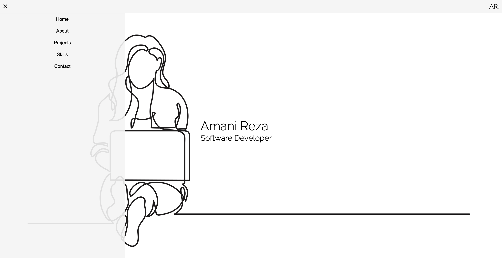

# Portfolio

This is the code for Amani Reza's Portfolio.

The intial draft is coded with HTML and SCSS.

It contains the following sections:

1.  landing page
2.  about me
3.  my skills
4.  projects
5.  contact me

The intial draft mostly contains the structure of the portfolio and the elements within each section. The style will likely be revised in the future.

Remaining actions for inital draft:

1.  address the responsivness issues of the site
2.  address the offset of the overall site
3.  add content to the skills page
4.  amend the overall styling
5.  inlcude links to Github and LinkedIn

To include in future versions by section:

-   Landing Page:

    -   add more styling and user interaction

-   Skills:

    -   present skills in scale format

-   Projects:

    -   implement hover and move effect and include more projects

-   Contact me:
    -   amend overall styling

